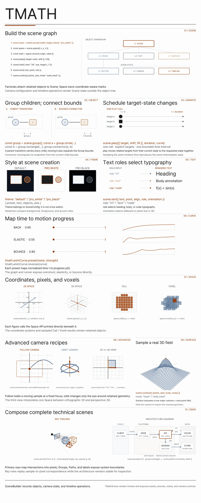

# tmath



tmath is a scene and timeline animation engine built on [ThorVG](https://github.com/thorvg/thorvg).
Scenes are authored in Lua (or through the JavaScript builder), evaluated at any time `t`,
and drawn through a retained ThorVG paint tree on the CPU or GL engine. The same core runs
natively (CLI: PNG/GIF/MP4) and in the browser (WASM).

- **Scene IR** — shapes, text, paths, pictures (SVG/PNG/JPG/WebP through one `picture` path),
  linear/radial/conic gradients, 3D solids, cells and voxels, themes, cameras and viewports.
- **Timeline** — `play`/`wait`/`shift`/transforms with easing, seekable at any frame.
- **Retained rendering** — one ThorVG paint tree per renderer; each frame updates changed
  paints in place instead of rebuilding the canvas ([architecture](docs/architecture.md)).
- **Optional modules** — `motion`, `diagram`, and the game modules `ui`, `input`, `runtime`
  (Lua runtime) and `audio` ([modules](docs/modules.md)).

## Build

```sh
meson setup build
meson compile -C build
meson test -C build --print-errorlogs
```

| Option | Default | Notes |
|---|---|---|
| `engines` | `cpu,gl` | CPU stays the runtime default; GL is dropped when the platform has no OpenGL. On macOS the `gl-parity` test compares CPU and GL output. |
| `modules` | none | e.g. `-Dmodules=motion,diagram` or `-Dmodules=all`. |
| `savers` | `all` | `gif`, `video` (MP4 through ffmpeg). |
| `bundled_thorvg` | `false` | Use the pinned ThorVG subproject instead of a system ThorVG (>= 1.2.0). |

WASM bundle (requires `emcc`): `scripts/wasm-bundle.sh` builds `build-wasm/` and syncs the
runtime into `tools/vscode/runtime` and `tools/skill/tmath-skills/assets/wasm`.

## Quick start

`scene.lua`:

```lua
local scene = tmath.scene {
    width = 960,
    height = 540,
    theme = "pro_white",
    camera = {mode = "fixed", view = "2d", height = 6},
}

local circle = scene:circle {
    id = "subject",
    center = {-2, 0},
    radius = 0.8,
    fill = "accent",
    stroke = "accent",
}

scene:shift(circle, {4, 0}, 1.2, "ease_in_out")
scene:wait(0.4)

return scene
```

```sh
build/tmath inspect scene.lua
build/tmath render scene.lua --time 0.6 -o frame.png
build/tmath render scene.lua --fps 30 -o scene.mp4
build/tmath render scene.lua --fps 20 -o scene.gif
build/tmath benchmark scene.lua --frames 120
build/tmath audit scene.lua --font src/examples/assets/Pretendard.ttf
```

## Layout

```
src/core/       libtmath: scene, renderer (ThorVG), loaders, savers, lua, modules
src/inc/        public headers (tmath.h + module headers)
src/cli/        tmath command-line tool
src/bindings/   wasm C ABI and JavaScript builder/client
src/test/       unit, golden, retained and GL-parity tests
src/examples/   representative Lua scenes and assets
tools/vscode/   VS Code preview extension
tools/skill/    agent authoring skills
scripts/        WASM cross file and bundle scripts
docs/           design notes
```

## References

- [Authoring skill](tools/skill/tmath-skills/SKILL.md) · [Lua API](tools/skill/tmath-skills/references/lua.md) · [JavaScript/TypeScript API](tools/skill/tmath-skills/references/javascript.md)
- [Architecture](docs/architecture.md) · [Modules](docs/modules.md) · [Themes](docs/themes.md) · [Scene composition](docs/scene-composition.md) · [Motion](docs/motion.md) · [Layout audit](docs/layout-audit.md) · [Cells and voxels](docs/cell-voxel.md) · [Audio](docs/audio.md)
- [Lua examples](src/examples/lua) · [VS Code extension](tools/vscode/README.md)
- [ThorVG](https://github.com/thorvg/thorvg) · [Manim Community](https://github.com/ManimCommunity/manim) · [ManimGL](https://github.com/3b1b/manim)
- [MIT License](LICENSE)
